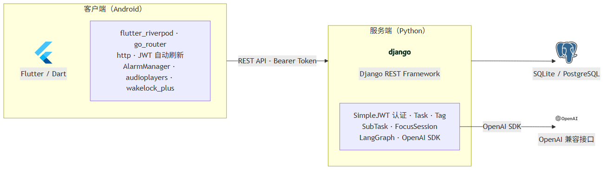
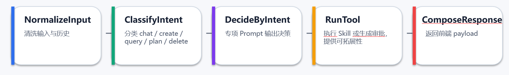

# ChronoCalendar

一款面向个人的智能日程管理应用，支持任务管理、番茄钟专注统计、数据导入导出、本地提醒与 AI 自然语言助手等功能。

---

## 目录

- [项目简介](#项目简介)
- [功能特性](#功能特性)
- [技术栈](#技术栈)
- [项目结构](#项目结构)
- [快速开始](#快速开始)
- [API 说明](#api-说明)
- [AI Agent](#ai-agent)
- [数据库设计](#数据库设计)
- [视觉设计](#视觉设计)
- [开发约定](#开发约定)

---

## 项目简介

ChronoCalendar 是一个前后端分离的移动端日程管理应用，前端使用 **Flutter** 构建客户端，后端使用 **Django REST Framework** 提供 API 服务，并集成基于 **LangGraph** 的 AI Agent，支持用户通过自然语言创建草稿、查询任务、规划长期任务和审批高风险操作。

---

## 功能特性

### 三类任务

| 类型 | 说明 |
|------|------|
| `block` | 固定时间段任务（有 `start_at / end_at`） |
| `ddl` | 截止时间任务（有 `due_at`） |
| `todo` | 待办清单（可含子任务、预期时长，可选截止时间） |

三类任务均支持：自定义标签、番茄钟专注、提醒时间、完成/取消/延期/稍后等状态流转。

### 主要页面

- **主页（最近任务）**：展示近期任务、Todo 列表与近 7 日按标签聚合的专注统计
- **任务列表**：按类型、状态、标签筛选，支持关键词搜索和排序
- **日历**：日 / 周 / 月三种视图，基于客户端任务缓存展示
- **设置**：账号管理、自定义标签、番茄钟设置、AI 配置、数据导入导出
- **番茄钟**：锁屏计时，白噪音 BGM，结束后上报专注会话
- **任务详情/编辑**：所有属性编辑，创建与编辑共用同一套表单
- **AI 对话**：自然语言创建草稿、查询、长期规划、删除审批、语音输入和朗读

### 提醒机制

提醒时间存于服务端，**实际闹铃由 Android 客户端本地调度**（本地通知 + 前台半屏弹窗）。服务端仅持久化 `remind_at` 字段，不提供 FCM、设备注册或服务端推送触发接口。

---

## 技术栈



### 后端

| 技术 | 版本 / 说明 |
|------|------------|
| Python | 3.x |
| Django | `>=4.2,<5.0` |
| Django REST Framework | `>=3.15` |
| SimpleJWT | Bearer Token 认证 |
| django-cors-headers | 跨域支持 |
| LangGraph | AI Agent 工作流引擎 |
| OpenAI SDK | 兼容 OpenAI 协议的 LLM / ASR / TTS 调用 |
| 数据库 | 开发环境 SQLite，生产推荐 PostgreSQL |
| Gunicorn / Docker | 后端容器化部署 |

### 前端

| 技术 | 版本 / 说明 |
|------|------------|
| Flutter / Dart | SDK `^3.11.4` |
| go_router | 路由管理与登录态重定向 |
| flutter_riverpod | 状态管理 |
| http / shared_preferences | HTTP 请求与 token 持久化 |
| audioplayers | 番茄钟白噪音播放 |
| flutter_local_notifications / timezone | 本地通知与时区处理 |
| wakelock_plus | 番茄钟锁屏保活 |
| speech_to_text / record / flutter_tts | 语音输入、录音与朗读 |
| file_picker / path_provider | 数据导入导出文件处理 |

---

## 项目结构

```text
ChronoCalendar/
├── backend/                  # Django 后端
│   ├── config/               # 项目配置（settings, urls, wsgi, healthz）
│   ├── accounts/             # 账号相关视图与路由
│   ├── tasks/                # 任务、标签、子任务、番茄钟模型与 API
│   ├── agent/                # AI Agent、LLM 配置、ASR/TTS 与审批
│   ├── demo_data/            # 导入导出测试数据
│   ├── Dockerfile
│   ├── manage.py
│   └── requirements.txt
│
├── frontend/                 # Flutter 前端
│   ├── lib/
│   │   ├── main.dart         # 应用入口
│   │   ├── app.dart          # 应用壳、主题与启动初始化
│   │   ├── core/             # API、路由、主题、通知、语音、工具函数
│   │   ├── data/             # Repository 与 Riverpod providers
│   │   ├── domain/           # 领域模型
│   │   ├── features/         # 按功能拆分的 UI 模块
│   │   └── shared/           # 公共组件
│   ├── assets/               # 客户端 logo、音频资源
│   └── pubspec.yaml
│
├── assets/                   # README 图片资源
├── deploy/                   # 部署配置
├── temp/                     # 临时文件，不提交
├── README.md                 # 项目说明文档
├── api.md                    # API / 数据库 / Agent 合并文档
└── deploy.md                 # 部署说明
```

---

## 快速开始

### 后端

**依赖环境**：Python 3.10+

```bash
cd backend

# 安装依赖
pip install -r requirements.txt

# 数据库迁移
python manage.py migrate

# 启动开发服务器（默认 http://localhost:8000）
python manage.py runserver
```

### 前端

**依赖环境**：Flutter SDK `^3.11.4`

```bash
cd frontend

# 获取依赖
flutter pub get

# 运行（Android 设备 / 模拟器）
flutter run
```

前端默认请求 `http://127.0.0.1:8000/api/v1`。Android 模拟器访问宿主机后端时使用：

```bash
flutter run --dart-define=API_BASE_URL=http://10.0.2.2:8000
```

`API_BASE_URL` 只填写后端根地址，不包含 `/api/v1`。

---

## API 说明

Base URL：`http://localhost:8000/api/v1`  
认证方式：`Authorization: Bearer <access_token>`

### 主要端点

| 功能 | Method | URL |
|------|--------|-----|
| 注册 | `POST` | `/auth/register/` |
| 登录 | `POST` | `/auth/login/` |
| 刷新 Token | `POST` | `/auth/refresh/` |
| 登出 | `POST` | `/auth/logout/` |
| 修改昵称 | `PATCH` | `/auth/me/` |
| 注销账户 | `DELETE` | `/auth/me/` |
| 修改密码 | `POST` | `/auth/change-password/` |
| 创建任务 | `POST` | `/tasks/` |
| 查询任务列表 | `GET` | `/tasks/?type=block&status=active` |
| 查询单个任务 | `GET` | `/tasks/{id}/` |
| 更新任务 | `PATCH` | `/tasks/{id}/` |
| 删除任务 | `DELETE` | `/tasks/{id}/` |
| 标记完成 | `POST` | `/tasks/{id}/complete/` |
| 取消任务 | `POST` | `/tasks/{id}/cancel/` |
| 稍后完成 | `POST` | `/tasks/{id}/snooze/` |
| 任务延期 | `POST` | `/tasks/{id}/postpone/` |
| 新增子任务 | `POST` | `/tasks/{id}/subtasks/` |
| 更新 / 删除子任务 | `PATCH/DELETE` | `/subtasks/{id}/` |
| 开始专注 | `POST` | `/focus-sessions/` |
| 结束专注 | `POST` | `/focus-sessions/{id}/stop/` |
| 近 7 日专注统计 | `GET` | `/stats/focus/last-week/` |
| 导出全部数据 | `GET` | `/tasks/export/` |
| 导入数据 | `POST` | `/tasks/import/?mode=merge\|duplicate` |

### 约定与规范

- 时间：统一使用 ISO 8601（UTC）存储与传输；客户端展示可按本地时区转换
- 通用响应结构
  - 成功：`{ "data": ... }`
  - 失败：`{ "error": { "code": "STRING", "message": "STRING", "details": {...?} } }`
- 任务 `type` 服务端创建后不可修改，前端通过“删除旧任务 + 创建新任务”模拟类型切换
- `overdue` 不落库，由服务端按当前时间实时计算

完整接口、错误码、导入导出结构、数据库表结构与 Agent API 见 [api.md](api.md)。

---

## AI Agent

Agent 基于 **LangGraph** 工作流引擎，通过 LLM 进行意图识别与工具调用。



### 交互模式

| 意图类型 | 处理方式 |
|----------|----------|
| 简单创建/编辑（单个任务） | 生成任务草稿 → 前端打开预填编辑页 → 用户确认后保存 |
| 长期规划 | 先收集需求与确认方案，再生成预览，用户确认后批量创建 |
| 危险操作（删除等） | 生成审批请求 → 前端展示审批卡 → 用户批准后执行 |
| 查询 | 调用 `search_tasks`，返回结构化查询结果 |
| 闲聊 | 自然语言回复 |

### 当前 Agent 流程

```
NormalizeInput → ClassifyIntent → DecideByIntent → RunTool → ComposeResponse
```

### 可用 Agent 工具（Skill）

- `search_tasks`：按关键词、类型、时间区间查询任务
- `build_task_draft`：生成任务草稿（用于打开编辑页）
- `check_block_conflict`：检测 block 时间冲突
- `delete_task`：删除任务，高风险，需要审批
- `plan_gather_requirements`：长期规划第一步，生成澄清问题
- `plan_generate_outline`：长期规划第二步，生成方案大纲
- `plan_schedule_tasks`：长期规划排程阶段，生成任务预览

---

## 数据库设计

核心表结构（以 PostgreSQL 语义描述，开发环境默认 SQLite）：

| 表名 | 说明 |
|------|------|
| `users` | 用户表，UUID 主键，email 登录 |
| `tags` | 用户自定义标签（名称 + 颜色） |
| `tasks` | 统一任务母表（type 区分三类） |
| `task_block` | block 任务扩展（start_at / end_at） |
| `task_ddl` | ddl 任务扩展（due_at） |
| `task_todo` | todo 任务扩展（expected_minutes / due_at） |
| `task_tags` | 任务-标签多对多关联 |
| `subtasks` | Todo 子任务 |
| `focus_sessions` | 番茄钟专注记录 |
| `agent_sessions` | Agent 会话 |
| `agent_messages` | Agent 消息 |
| `agent_approval_requests` | 高风险操作审批 |
| `agent_llm_config` | 用户级 LLM / ASR / TTS 配置 |

设计原则：

- 时间统一使用 UTC；展示由客户端按时区转换
- 按 `user_id` 隔离数据
- `overdue` 不落库，通过 `due_at/end_at < now AND status=active` 计算
- `focus_total_seconds` 读取时从已停止的 `focus_sessions.actual_seconds` 聚合

---

## 视觉设计

总体方向：极简、浅色优先、信息清晰、少装饰。

- **色彩**：主色使用冷静蓝，页面背景浅色，语义色仅用于完成、警告、错误等状态
- **排版**：标题、任务标题、正文、辅助信息分层明确，统计数字突出显示
- **形状与间距**：使用 8dp 栅格，卡片、列表行、输入框保持统一圆角
- **动效**：页面切换和日历视图切换以 200ms～300ms 的克制动画为主
- **无障碍**：可点击区域不低于 48×48dp，不单独依赖颜色表达状态

---

## 开发约定

- `main` 为集成分支，开发分支当前为 `devLX`
- `temp/` 仅用于截图与临时素材，不提交
- 后端新增成功响应复用 `tasks.views.ok()`，错误响应复用 `err()` 或统一异常结构
- 新增任务字段时，同步更新后端模型/序列化器、`api.md`、前端 `domain/models/task.dart` 与 `data/task_json.dart`
- 前端状态管理使用 Riverpod；任务与标签由 `TaskRepository` 缓存，页面优先读本地仓库状态
- API 异常在前端优先使用 `core/ui/app_error_dialog.dart` 展示
- 代码注释和 UI 文案以中文为主，保持现有风格

