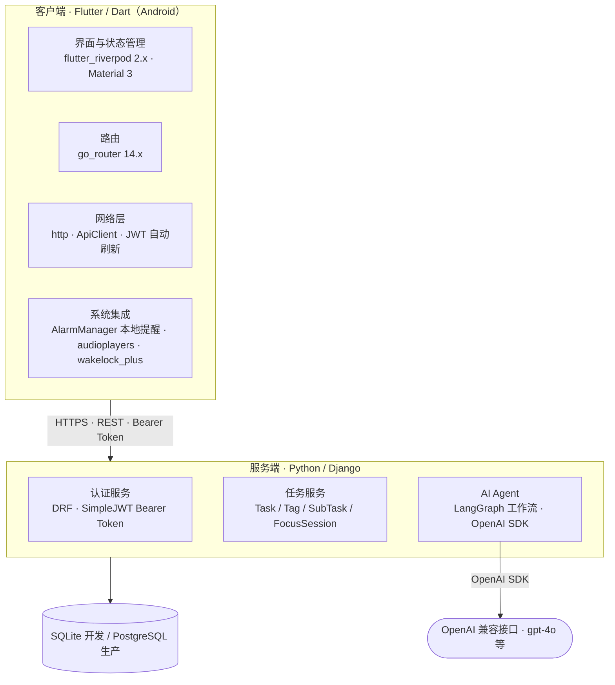

# ChronoCalendar

一款面向个人的智能日程管理应用，支持任务管理、番茄钟专注统计与 AI 自然语言助手等功能。

---

## 目录

- [项目简介](#项目简介)
- [功能特性](#功能特性)
- [技术栈](#技术栈)
- [项目结构](#项目结构)
- [快速开始](#快速开始)
- [API 说明](#api-说明)
- [AI Agent](#ai-agent)
- [数据库设计](#数据库设计)

---

## 项目简介

ChronoCalendar 是一个前后端分离的移动端日程管理应用，前端使用 **Flutter** 构建客户端（Android），后端使用 **Django REST Framework** 提供 API 服务，并集成基于 **LangGraph** 的 AI Agent，支持用户通过自然语言创建、查询、规划任务。

---

## 功能特性

### 三类任务

| 类型 | 说明 |
|------|------|
| `block` | 固定时间段任务（有 `start_at / end_at`） |
| `ddl` | 截止时间任务（有 `due_at`） |
| `todo` | 待办清单（可含子任务、预期时长，可选截止时间） |

三类任务均支持：自定义标签、番茄钟专注、完成/取消/延期/稍后等状态流转。

### 主要页面

- **主页（最近任务）**：展示今明两天任务、本周统计（完成数/标签分布）、全部 Todo 列表
- **任务列表**：按类型筛选、按标签/时间排序，支持搜索
- **日历**：日 / 周 / 月三种视图，平滑切换动画
- **设置**：账号管理、自定义标签（颜色 + 名称）
- **番茄钟**：锁屏计时，白噪音 BGM，杀后台自动结束
- **任务详情/编辑**：所有属性编辑，AI 快捷输入入口
- **AI 对话**：自然语言创建、查询、规划、危险操作审批

### 提醒机制

提醒时间存于服务端，**实际闹铃由 Android 客户端本地调度**（`AlarmManager` + 系统通知），App 在前台时展示半屏弹窗，后台时发本地推送通知。

---

## 技术栈



### 后端

| 技术 | 版本 / 说明 |
|------|------------|
| Python | 3.x |
| Django | ≥ 4.2, < 5.0 |
| Django REST Framework | ≥ 3.15 |
| SimpleJWT | ≥ 5.3，Bearer Token 认证 |
| django-cors-headers | 跨域支持 |
| LangGraph | ≥ 0.2，AI Agent 工作流引擎 |
| OpenAI SDK | ≥ 1.0，LLM 调用 |
| 数据库 | 开发环境 SQLite，生产推荐 PostgreSQL |

### 前端

| 技术 | 版本 / 说明 |
|------|------------|
| Flutter / Dart | SDK ^3.11.4 |
| go_router | ≥ 14.6，路由管理 |
| flutter_riverpod | ≥ 2.6，状态管理 |
| http | HTTP 请求 |
| audioplayers | 番茄钟白噪音播放 |
| flutter_local_notifications | 本地通知 |
| wakelock_plus | 番茄钟锁屏保活 |
| google_fonts | 字体 |
| intl | 国际化 / 时间格式化 |
| timezone | 时区处理 |

---

## 项目结构

```
ChronoCalendar/
├── backend/                  # Django 后端
│   ├── config/               # 项目配置（settings, urls, wsgi）
│   ├── accounts/             # 账号相关视图与路由
│   ├── tasks/                # 任务、标签、子任务、番茄钟模型与 API
│   │   ├── models.py         # User / Tag / Task / TaskBlock / TaskDDL / TaskTodo / SubTask / FocusSession
│   │   ├── views.py
│   │   ├── serializers.py
│   │   └── urls.py
│   ├── agent/                # AI Agent 模块
│   │   ├── graph.py          # LangGraph 工作流（意图决策 → 工具调用 → 响应）
│   │   ├── llm.py            # LLM 调用封装
│   │   ├── tools.py          # 工具实现（搜索、草稿、规划、删除审批等）
│   │   ├── registry.py       # Skill 注册与描述生成
│   │   ├── models.py         # AgentSession / AgentMessage / ApprovalRequest
│   │   ├── views.py          # Agent API 视图
│   │   └── urls.py
│   ├── manage.py
│   ├── requirements.txt
│   └── db.sqlite3            # 开发数据库（git 忽略）
│
├── frontend/                 # Flutter 前端
│   ├── lib/
│   │   ├── main.dart         # 应用入口
│   │   ├── app.dart          # 路由与主题配置
│   │   ├── core/             # 网络请求、常量、工具函数
│   │   ├── data/             # 数据层（Repository、数据源）
│   │   ├── domain/           # 领域模型与接口
│   │   ├── features/         # 按功能拆分的 UI 模块
│   │   │   ├── auth/         # 登录/注册
│   │   │   ├── home/         # 主页（最近任务 + 统计）
│   │   │   ├── task_list/    # 任务列表
│   │   │   ├── task_create/  # 新建任务
│   │   │   ├── task_detail/  # 任务详情/编辑
│   │   │   ├── calendar/     # 日历（日/周/月）
│   │   │   ├── pomodoro/     # 番茄钟
│   │   │   ├── agent_chat/   # AI 对话
│   │   │   ├── settings/     # 设置
│   │   │   └── shell/        # 底部导航壳
│   │   └── shared/           # 公共组件
│   ├── assets/audio/         # 白噪音音频资源
│   └── pubspec.yaml
│
├── README.md                 # 项目说明文档
```

---

## 快速开始

### 后端

**依赖环境**：Python 3.10+

```bash
cd backend

# 安装依赖
pip install -r requirements.txt

# 数据库迁移
python manage.py migrate

# 启动开发服务器（默认 http://localhost:8000）
python manage.py runserver
```

### 前端

**依赖环境**：Flutter SDK ^3.11.4

```bash
cd frontend

# 获取依赖
flutter pub get

# 运行（Android 设备 / 模拟器）
flutter run
```

前端默认请求 `http://localhost:8000/api/v1`，如需修改后端地址，请更新 `lib/core/` 中的网络配置常量。

---

## API 说明

Base URL：`http://localhost:8000/api/v1`  
认证方式：`Authorization: Bearer <access_token>`

### 主要端点

| 功能 | Method | URL |
|------|--------|-----|
| 注册 | `POST` | `/auth/register/` |
| 登录 | `POST` | `/auth/login/` |
| 刷新 Token | `POST` | `/auth/refresh/` |
| 登出 | `POST` | `/auth/logout/` |
| 创建任务 | `POST` | `/tasks/` |
| 查询任务列表 | `GET` | `/tasks/?type=block&status=active` |
| 查询单个任务 | `GET` | `/tasks/{id}/` |
| 更新任务 | `PATCH` | `/tasks/{id}/` |
| 删除任务 | `DELETE` | `/tasks/{id}/` |
| 标记完成 | `POST` | `/tasks/{id}/complete/` |
| 取消任务 | `POST` | `/tasks/{id}/cancel/` |
| 稍后完成 | `POST` | `/tasks/{id}/snooze/` |
| 任务延期 | `POST` | `/tasks/{id}/postpone/` |
| 新增子任务 | `POST` | `/tasks/{id}/subtasks/` |
| 更新子任务 | `PATCH` | `/subtasks/{id}/` |
| 导出全部数据 | `GET` | `/tasks/export/` |
| 导入数据 | `POST` | `/tasks/import/?mode=merge\|duplicate` |

### 约定与规范

- 时间：统一使用 ISO 8601（UTC）存储与传输；客户端展示可按本地时区转换
- 通用响应结构
  - 成功：`{ "data": ... }`
  - 失败：`{ "error": { "code": "STRING", "message": "STRING", "details": {...?} } }`
- 任务提醒：由 Android 客户端本地调度（`AlarmManager` + 系统通知）；服务端仅持久化 `remind_at` 字段，**不提供推送服务**

---

### 认证接口

#### 登录 `POST /auth/login`

**Body**

```json
{ "email": "a@b.com", "password": "xxx" }
```

**Resp**

```json
{
  "data": {
    "access_token": "...",
    "refresh_token": "...",
    "user": { "id": "...", "name": "..." }
  }
}
```

#### 刷新 Token `POST /auth/refresh`

**Body**：`{ "refresh_token": "..." }`

#### 退出登录 `POST /auth/logout`

---

### 标签接口

| 操作 | Method | URL | Body |
|------|--------|-----|------|
| 创建标签 | `POST` | `/tags` | `{ "name": "学习", "color": "#4F46E5" }` |
| 获取标签列表 | `GET` | `/tags` | — |
| 更新标签 | `PATCH` | `/tags/{tagId}` | `{ "name": "...", "color": "..." }` |
| 删除标签 | `DELETE` | `/tags/{tagId}` | — |

---

### 任务数据模型

三类任务共享 `/tasks` 集合，以 `type` 字段区分。

#### 通用字段

| 字段 | 类型 | 读写 | 说明 |
|------|------|------|------|
| `id` | `string` | 只读 | UUID |
| `type` | `"block" \| "ddl" \| "todo"` | 创建时必填，不可修改 | 任务类型 |
| `title` | `string` | 必填 | 标题 |
| `description` | `string?` | 可选 | 备注，默认空字符串 |
| `tag_ids` | `string[]` | 可选 | 关联标签 ID 列表，默认 `[]` |
| `status` | `"active" \| "completed" \| "cancelled" \| "overdue"` | 只读 | 任务状态 |
| `remind_at` | `datetime?` | 可选 | 提醒时间（UTC）；`null` 表示不提醒；客户端本地调度 |
| `focus_total_seconds` | `number` | 只读 | 累计专注秒数 |
| `created_at` | `datetime` | 只读 | 创建时间（UTC） |
| `updated_at` | `datetime` | 只读 | 最近更新时间（UTC） |

#### Block 额外字段

| 字段 | 类型 | 读写 | 说明 |
|------|------|------|------|
| `start_at` | `datetime` | 必填 | 开始时间（UTC） |
| `end_at` | `datetime` | 必填 | 结束时间（UTC）；须严格晚于 `start_at` |

**约束**：`end_at > start_at`，否则返回 `400 INVALID_TIME_RANGE`

**响应示例**

```json
{
  "id": "blk_001", "type": "block", "title": "高数课", "description": "第五章极限",
  "tag_ids": ["tag_study"], "status": "active",
  "start_at": "2026-04-22T08:00:00Z", "end_at": "2026-04-22T09:40:00Z",
  "remind_at": "2026-04-22T07:50:00Z", "focus_total_seconds": 0,
  "created_at": "2026-04-21T12:00:00Z", "updated_at": "2026-04-21T12:00:00Z"
}
```

#### DDL 额外字段

| 字段 | 类型 | 读写 | 说明 |
|------|------|------|------|
| `due_at` | `datetime` | 必填 | 截止时间（UTC）；超时后 `status` 自动变为 `overdue` |

**约束**：`postpone` 操作仅更新 `due_at`，同时重置 `status` 为 `active`

#### Todo 额外字段

| 字段 | 类型 | 读写 | 说明 |
|------|------|------|------|
| `due_at` | `datetime?` | 可选 | 截止时间；有值时超时标记 `overdue` |
| `expected_minutes` | `number?` | 可选 | 预期投入时长（分钟，正整数） |
| `subtasks` | `SubTask[]` | 可选 | 子任务列表，默认 `[]` |

**SubTask 结构**

| 字段 | 类型 | 说明 |
|------|------|------|
| `id` | `string` | 只读，UUID |
| `title` | `string` | 子任务标题 |
| `done` | `boolean` | 是否完成，默认 `false` |
| `order` | `number` | 排序序号（升序），从 1 开始 |

**Todo 响应示例**

```json
{
  "id": "todo_001", "type": "todo", "title": "复习线性代数",
  "tag_ids": ["tag_study"], "status": "active",
  "due_at": "2026-04-28T00:00:00Z", "remind_at": "2026-04-27T20:00:00Z",
  "expected_minutes": 120, "focus_total_seconds": 5400,
  "subtasks": [
    { "id": "sub_001", "title": "第一章例题", "done": true,  "order": 1 },
    { "id": "sub_002", "title": "第二章习题", "done": false, "order": 2 }
  ],
  "created_at": "2026-04-20T10:00:00Z", "updated_at": "2026-04-21T18:30:00Z"
}
```

#### 状态流转

```
         active
         ├── 手动 complete → completed
         ├── 手动 cancel   → cancelled
         └── 超出 due_at / end_at → overdue
                           └── postpone / snooze → active（due_at 更新）
```

---

### 任务接口详情

#### 创建任务 `POST /tasks`

```json
// block
{ "type": "block", "title": "上课", "tag_ids": [], "start_at": "2026-04-07T09:00:00Z", "end_at": "2026-04-07T10:30:00Z", "remind_at": "2026-04-07T08:45:00Z" }
// ddl
{ "type": "ddl", "title": "交作业", "tag_ids": [], "due_at": "2026-04-08T16:00:00Z" }
// todo
{ "type": "todo", "title": "复习线代", "expected_minutes": 120, "subtasks": [{ "title": "第一章例题", "order": 1 }] }
```

#### 获取任务列表 `GET /tasks`

| 参数 | 说明 |
|------|------|
| `type` | `block \| ddl \| todo`（可选） |
| `q` | 关键词，对 `title` 模糊匹配 |
| `tag_ids` | 多标签 AND 过滤，逗号分隔 |
| `status` | `active \| completed \| cancelled \| overdue` |
| `sort` | `due_at_asc/desc`、`start_at_asc/desc`、`spent_desc`、`created_at_asc/desc` |
| `page` / `page_size` | 分页（默认 1 / 20，上限 100） |

**默认排序**：ddl → `due_at_asc`；block → `start_at_asc`；todo → `last_activity_at` 降序；混合 → `created_at_desc`

**Resp**：`{ "data": { "items": [...], "page": 1, "page_size": 20, "total": 123 } }`

#### 其他任务操作

| 操作 | Method & URL | Body |
|------|-------------|------|
| 获取详情 | `GET /tasks/{id}` | — |
| 更新 | `PATCH /tasks/{id}` | `title/description/tag_ids/remind_at` 及类型相关字段 |
| 删除 | `DELETE /tasks/{id}` | — |
| 标记完成 | `POST /tasks/{id}/complete` | — |
| 取消 | `POST /tasks/{id}/cancel` | — |
| 稍后 | `POST /tasks/{id}/snooze` | `{ "until": "2026-04-07T12:00:00Z" }` |
| 延期 | `POST /tasks/{id}/postpone` | `{ "due_at": "2026-04-08T16:00:00Z" }` |

---

### 子任务接口

| 操作 | Method & URL | Body |
|------|-------------|------|
| 新增 | `POST /tasks/{id}/subtasks` | `{ "title": "...", "order": 1 }` |
| 更新 | `PATCH /subtasks/{id}` | `{ "done": true }` |
| 删除 | `DELETE /subtasks/{id}` | — |

---

### 首页接口

- **GET** `/home/upcoming`：今天+明天的 block（按 `start_at`）与 ddl（按 `due_at`）合并排序；Query：`from`、`to`
- **GET** `/home/recent-todos`：最近使用的 Todo 列表；Query：`limit=50`

---

### 番茄钟接口

#### 开始专注 `POST /focus-sessions`

```json
{ "task_id": "...", "planned_seconds": 1500, "noise_id": "rain_01" }
```

#### 结束专注 `POST /focus-sessions/{id}/stop`

```json
{ "ended_at": "2026-04-07T09:25:00Z", "reason": "manual" }
```

`reason` 可选值：`manual` / `app_killed` / `timeout`

#### 获取任务专注统计 `GET /tasks/{id}/focus-summary`

Query：`from` / `to`（可选）

---

### 统计接口

#### 本周任务统计 `GET /stats/tasks/weekly`

Query：`week_start=2026-04-06`（可选，默认本周周一）

**Resp**：`{ "data": { "completed": 12, "pending": 7, "cancelled": 1, "overdue": 2, "top_tag": { "tag_id": "...", "name": "学习", "count": 6 } } }`

#### 每日按标签专注统计 `GET /stats/focus/daily-by-tag`

Query：`from` / `to`

**Resp**：`{ "data": [{ "date": "2026-04-07", "tags": [{ "tag_id": "...", "seconds": 3600 }] }] }`

---

### 日历接口 `GET /calendar/events`

| 参数 | 说明 |
|------|------|
| `view` | `day \| week \| month` |
| `anchor` | 视图锚点日期，如 `2026-04-07` |
| `tz` | 时区（可选），如 `Asia/Shanghai` |

**Resp 事件结构**：`{ "id", "source": "task", "type", "title", "start_at", "end_at", "tag_ids", "all_day"? }`

---

### 任务提醒说明

`remind_at` 字段由 API 在创建/更新任务时返回；**客户端**收到任务后自行调度/取消本地闹钟（`AlarmManager`）。任务完成、删除、延期、稍后后客户端须同步取消或重排对应闹钟。服务端不提供 FCM / 设备注册 / 推送触发等接口。

---

## AI Agent

Agent 基于 **LangGraph** 工作流引擎，通过 LLM 进行意图识别与工具调用。

### 交互模式

| 意图类型 | 处理方式 |
|----------|----------|
| 简单创建/编辑（单个任务） | 生成任务草稿 → 前端弹出预填编辑页 → 用户确认后保存 |
| 复杂规划（跨多天/多任务） | 直接创建任务，前端展示"本次创建清单"，支持撤销 |
| 危险操作（删除/批量改动） | 生成审批请求 → 前端展示审批卡 → 用户批准后执行 |
| 查询/统计 | 直接返回结构化查询结果卡片 |
| 闲聊 | 自然语言回复 |

### Agent API 端点

| 功能 | Method | URL |
|------|--------|-----|
| 创建会话 | `POST` | `/agent/sessions/` |
| 发送消息 | `POST` | `/agent/sessions/{id}/messages/` |
| 获取历史消息 | `GET` | `/agent/sessions/{id}/messages/` |
| 审批操作 | `POST` | `/agent/approvals/{id}/approve/` |
| 拒绝操作 | `POST` | `/agent/approvals/{id}/reject/` |

### 可用 Agent 工具（Skill）

- `search_tasks`：按关键词/类型搜索任务
- `build_task_draft`：生成任务草稿（用于打开编辑页）
- `get_calendar_overview`：查询日历日程概览
- `generate_long_term_plan`：生成并创建长期规划任务
- `delete_task`：创建删除审批请求（不直接删除）
- `check_conflict`：检测时间冲突

---

## 数据库设计

核心表结构（以 PostgreSQL 语义描述，开发环境使用 SQLite）：

| 表名 | 说明 |
|------|------|
| `users` | 用户表，UUID 主键，email 登录 |
| `tags` | 用户自定义标签（名称 + 颜色） |
| `tasks` | 统一任务母表（type 区分三类） |
| `task_block` | block 任务扩展（start_at / end_at） |
| `task_ddl` | ddl 任务扩展（due_at） |
| `task_todo` | todo 任务扩展（expected_minutes / due_at） |
| `task_tags` | 任务-标签多对多关联 |
| `subtasks` | Todo 子任务 |
| `focus_sessions` | 番茄钟专注记录 |

### 详细字段定义

**设计原则**
- 时间统一使用 UTC（`timestamptz`），展示由客户端按时区转换
- 按 `user_id` 多租户隔离
- "超时 overdue"不落库，通过 `due_at < now AND status=active` 计算；如需加速统计可加冗余字段并用定时任务维护

#### `users`

| 字段 | 说明 |
|------|------|
| `id` | PK, UUID |
| `email` | 唯一，登录邮箱 |
| `password_hash` | 密码哈希 |
| `name` | 显示名称 |
| `created_at` / `updated_at` | 创建/更新时间 |

#### `tags`

| 字段 | 说明 |
|------|------|
| `id` | PK, UUID |
| `user_id` | FK → users.id，indexed |
| `name` | 标签名 |
| `color` | 颜色值（如 `#RRGGBB`） |
| `created_at` / `updated_at` | — |

**约束**：`(user_id, name)` 唯一（防止同用户重名）

#### `tasks`（统一任务母表）

| 字段 | 说明 |
|------|------|
| `id` | PK, UUID |
| `user_id` | FK → users.id，indexed |
| `type` | enum: block/ddl/todo，indexed |
| `title` | 任务标题 |
| `description` | 备注（nullable） |
| `status` | enum: active/completed/cancelled，indexed |
| `created_at` / `updated_at` | — |
| `completed_at` | 完成时间（nullable） |
| `cancelled_at` | 取消时间（nullable） |
| `last_activity_at` | 最近活动时间，indexed；用于最近 Todo 排序 |
| `snoozed_until` | 稍后时间，nullable，indexed |
| `remind_at` | 提醒时间，nullable，indexed；客户端据此注册本地闹钟 |

#### `task_block`

| 字段 | 说明 |
|------|------|
| `task_id` | PK, FK → tasks.id |
| `start_at` | indexed |
| `end_at` | indexed |

**约束**：`end_at > start_at`

#### `task_ddl`

| 字段 | 说明 |
|------|------|
| `task_id` | PK, FK → tasks.id |
| `due_at` | indexed |

#### `task_todo`

| 字段 | 说明 |
|------|------|
| `task_id` | PK, FK → tasks.id |
| `expected_minutes` | 预期时长（nullable） |
| `due_at` | 可选截止时间，nullable，indexed |

#### `task_tags`（任务-标签多对多）

| 字段 | 说明 |
|------|------|
| `task_id` | FK → tasks.id |
| `tag_id` | FK → tags.id |

**PK**：`(task_id, tag_id)`；**额外索引**：`(tag_id, task_id)`（按标签筛选任务）

#### `subtasks`（Todo 子任务）

| 字段 | 说明 |
|------|------|
| `id` | PK, UUID |
| `task_id` | FK → tasks.id，indexed；仅关联 type=todo 的任务 |
| `title` | 子任务标题 |
| `done` | bool，indexed |
| `order` | int，显示顺序 |
| `created_at` / `updated_at` | — |
| `done_at` | 完成时间（nullable） |

#### `focus_sessions`（番茄钟专注记录）

| 字段 | 说明 |
|------|------|
| `id` | PK, UUID |
| `user_id` | FK → users.id，indexed |
| `task_id` | FK → tasks.id，indexed |
| `status` | enum: running/stopped，indexed |
| `started_at` | indexed |
| `ended_at` | nullable，indexed |
| `planned_seconds` | 计划时长（秒） |
| `actual_seconds` | 实际时长，nullable；停止时计算写入 |
| `stop_reason` | enum: manual/app_killed/timeout，nullable |
| `noise_id` | 白噪音预设标识（nullable） |

> 每天按标签专注统计可由 `focus_sessions` join `task_tags` 聚合得到；数据量大时可做增量汇总表 `focus_daily_tag_stats(user_id, date, tag_id, seconds)`。

---

### 关键查询与索引建议

#### 首页「今天+明天任务」

- block：按 `task_block.start_at` 范围查询
- ddl：按 `task_ddl.due_at` 范围查询
- 建议索引：`task_block(start_at)`、`task_block(end_at)`、`task_ddl(due_at)`、`tasks(user_id, status, type)`、`tasks(user_id, last_activity_at)`

#### 统计（周任务数 + 每日按标签专注柱状图）

- **直接聚合（中小规模）**：按 `focus_sessions.started_at` 日期分桶，再 join 标签聚合
- **可选汇总表（大规模）**：`focus_daily_tag_stats(user_id, date, tag_id, seconds)`；由 session stop 时增量更新，或定时任务重算

#### 任务列表筛选/排序

- 标签筛选：走 `task_tags(tag_id, task_id)`
- ddl 按截止时间排序：走 `task_ddl(due_at)`
- todo 按已花费时长排序：维护 `tasks.focus_total_seconds` 冗余字段（每次 session stop 增量更新）
